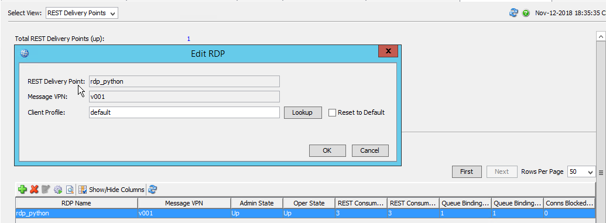
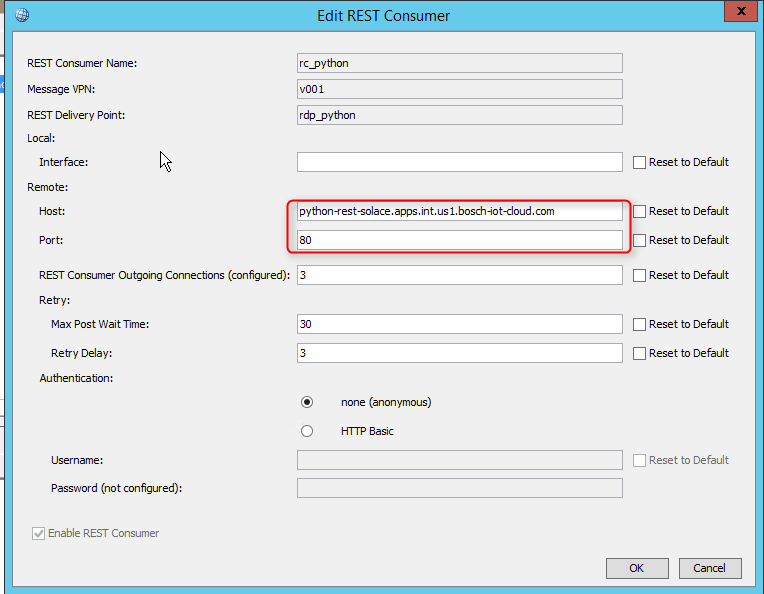
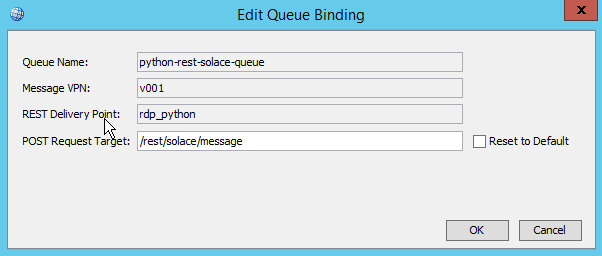
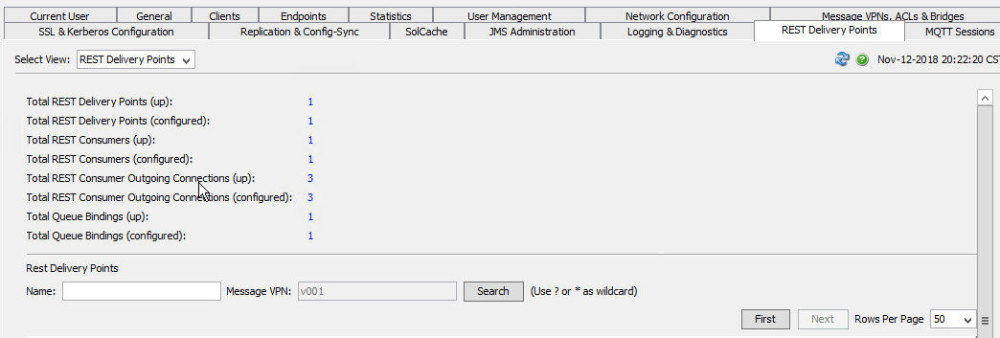

A *Python* app which target to demo how to use REST protocol to connect to solace pubsub+ in the cloud foundry platform.

The app use
 * Flask      to provide a url which can be accessed.
 * requests   to 1). invoke the solace api to create and queue and 2). publish message to pubsub+
 * flask-restful to provide an RESTFUL post method which act as the consumer and listen to the solace *push*
 
so your *requirements.txt* should like this:
```text
Flask>=0.11.0
requests
flask-restful
```

**How to use it:**

- Download and push the app to the cloud foundry platform.
- Provision and solace instance and bind to the app.
- Restart/Restage the app.
- http://{link_to_app}/rest/solace/queue in the brower in order to create an pubsub+ queue.
- Configure the rest delivery point in solace pubsub+
  1. Navigate to 'REST Delivery Points' of the SolAdmin.
  2. Select view 'REST Delivery Points', and click the plus to create:
  
   After the RDP created, enable it.
   
   Note:Make sure, the Client Profile you selected are Guaranteed Message Receive allowed.
  3. Select Consumers view and click the plus to create:
   
    - Host: the hostname of the machine which host your app.
    - Port: the port of the application.
    
    After the Consumer created, enable it.
    
  4. Select the Queue Bindings view and click the plus to add.
   
   
  5. Check the overview of the rdp in the 'REST Delivery Points' view, all should 'UP'
   
   
**How to test it:**

The app contains to url,

- Do a 'PUT' request to http://{link_to_app}/rest/solace/message, this will publish a message to pubsub+
- Check the application log, there should be something like:
```text
Got message:{'message': 'I am a test'}
```
- Or issue a 'GET' request to http://{link_to_app}/rest/solace/message
